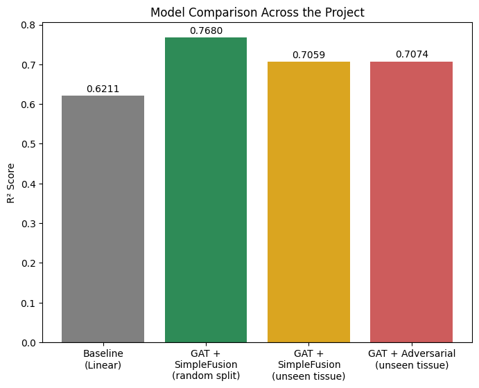
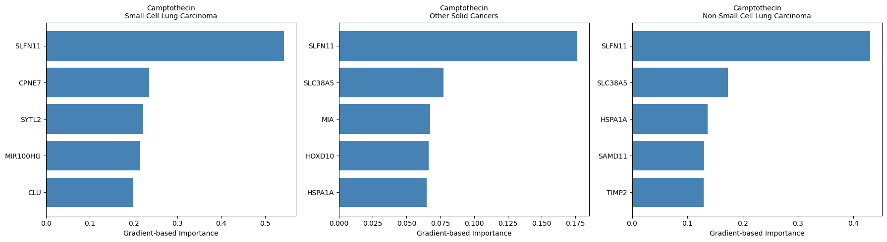
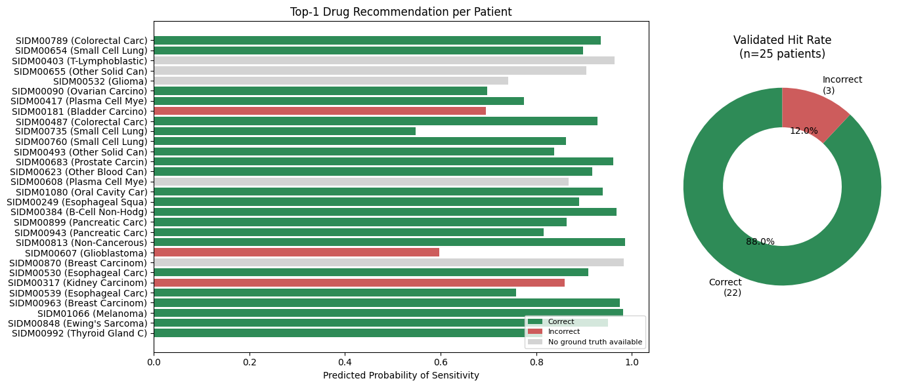

# DRP-GAT-XU


Explainable, uncertainty-aware graph attention network for predicting cancer cell-line drug response on **GDSC2**.

---

## Overview

Most drug-response models report a single R² on a random train/test split, which says nothing about whether the model works on a cancer type it has never seen, whether its confidence can be trusted, or whether its recommendation would help a specific patient.

DRP-GAT-XU predicts drug response (LN_IC50) by jointly encoding a drug's molecular graph and a cell line's gene expression profile, then is evaluated the way an actual deployment scenario demands: on tissue types excluded entirely from training, with calibrated per-prediction confidence, with gene-level explanations checked against an independent biomarker, and with a per-patient drug ranking validated against real outcomes.

```text
Drug SMILES → Molecular Graph → GAT encoder (2 layers, 4 heads) ──┐
                                                                    ├─▶ concat → FC + ReLU → predicted LN_IC50
Gene expression (1000-dim) → MLP encoder (2 layers) ──────────────┘
```

---

## Why This Is More Than a Baseline R²

- **Held-out tissue evaluation** — three cancer types (kidney, pancreatic, hepatocellular carcinoma) are excluded entirely from training, not just from a random split, and evaluated as an actual generalization test.
- **A negative result, reported honestly** — a domain-adversarial variant (gradient reversal layer) was trained specifically to close the unseen-tissue gap. It didn't, by a statistically tested margin (Wilcoxon signed-rank test, p=0.121). That result is in this README, not hidden.
- **Explanations checked against biology, not just ranked** — SLFN11's role as a topoisomerase-inhibitor biomarker is independently established in the pharmacogenomics literature, and the attribution is only recovered after fixing a data leakage issue in preprocessing.
- **Confidence that means something** — Monte Carlo dropout uncertainty is validated against real prediction error, not just reported as a number.
- **A decision output checked against outcomes** — the per-patient drug ranking is validated against real ground-truth labels, not only described in theory.

---

## Dataset

[GDSC2 — Genomics of Drug Sensitivity in Cancer](https://www.cancerrxgene.org/downloads/bulk_download)

- 245 drugs with resolved molecular structure (SMILES)
- 944 cancer cell lines with matched RNA-seq expression
- 206,145 drug–cell line response pairs across 42 cancer types

Gene selection and expression normalization are computed strictly from the training split — see [`data/README.md`](data/README.md) for download instructions and the full preprocessing pipeline, including the leakage issue this addresses.

---

## Methodology

**Preprocessing** — cell lines are split 70/15/15 (train/val/test) at the cell-line level; the top 1,000 variable genes and normalization statistics are computed from the training split only.

**Model** — a GAT encoder (128-dim, 4 heads, 2 layers) over the drug's molecular graph and an MLP encoder (128-dim, 2 layers) over gene expression are fused by concatenation and a fully connected layer.

**Training** — Adam, lr=1e-3, weight decay=1e-5, batch size 32, up to 20 epochs with early stopping (patience=5).

**Domain generalization** — three tissue types are held out entirely; a domain-adversarial variant adds a gradient-reversal layer and an auxiliary tissue classifier on the fused representation. Both variants are compared with bootstrap 95% CIs (1,000 resamples) and a paired Wilcoxon test on per-sample squared error.

**Explainability** — gradient-based attribution on the input expression vector (gene-level) and on atom features (molecule-level).

**Uncertainty** — Monte Carlo dropout, 30–50 stochastic forward passes at inference, converted to a calibrated per-drug sensitivity probability via a temperature-scaled sigmoid.

Full hyperparameters: [`configs/config.py`](configs/config.py).

---

## Results

### Model Performance

| Metric | Value |
|:---|:---|
| Linear baseline (R²) | 0.621 |
| GAT, random split (R²) | 0.768 |
| GAT, unseen tissue (R²) | 0.706 |
| GAT, unseen tissue + domain-adversarial (R²) | 0.707 |
| Domain-adversarial vs. baseline | not significant (Wilcoxon p=0.121) |

<p align="center">
  
</p>
<p align="center"><sub>R² across the linear baseline, the random-split model, and the unseen-tissue model with and without domain-adversarial training.</sub></p>

The domain-adversarial objective was tested specifically to close the unseen-tissue gap; it did not produce a statistically significant improvement, so it was not adopted in the final model.

### Explainability

Gradient-based attribution for camptothecin (a topoisomerase I inhibitor) consistently ranks **SLFN11** as the top predictive gene across three different cancer types — consistent with its independently established role in topoisomerase-inhibitor sensitivity. This signal is only recovered once the gene-selection and normalization leakage described in [`data/README.md`](data/README.md) is corrected.

<p align="center">
  
</p>
<p align="center"><sub>Gene attribution for camptothecin across three cancer types.</sub></p>

Atom-level attribution and the full sensitivity-classification breakdown (67.7% accuracy against a 50% chance baseline, using a per-drug threshold) are in [`assets/results/explainability/`](assets/results/explainability/).

### Error Analysis

Mean absolute error by cancer type and by drug on the full test set. Kidney and pancreatic carcinoma — two of the three tissues held out in the domain generalization experiment — independently rank among the hardest to predict, providing convergent evidence from an unrelated analysis. Full breakdown: [`assets/results/error_analysis/`](assets/results/error_analysis/).

### Uncertainty Calibration

Monte Carlo dropout uncertainty correlates with actual prediction error (r=0.30, p<0.0001), validated on 200 randomly sampled test predictions. See [`assets/results/uncertainty/`](assets/results/uncertainty/) for the full plot.

### Clinical Decision Dashboard

| Metric | Value |
|:---|:---|
| Non-personalized baseline (top-1 accuracy) | 61.1% (22/36) |
| Personalized ranking, this model (top-1 accuracy) | 88.0% (22/25) |

For a given patient, all 245 drugs are ranked by a calibrated sensitivity probability. The top-ranked recommendation is checked against the patient's real ground-truth response where available.

<p align="center">
  
</p>
<p align="center"><sub>Per-patient drug ranking, validated against ground-truth response labels (n=25).</sub></p>

---

## Project Structure

```text
DRP-GAT-XU/
├── assets/results/     result figures
├── configs/             hyperparameters and paths
├── data/                 preprocessing, dataset class, graph construction
├── models/               architecture, domain-adversarial variant, checkpoints
├── src/                   training, evaluation, explainability, uncertainty, dashboard
├── main.py                end-to-end pipeline entry point
└── requirements.txt
```

---

## Quickstart

```bash
git clone https://github.com/SarvinChitsaz/DRP-GAT-XU.git
cd DRP-GAT-XU
pip install -r requirements.txt
```

Download and place the GDSC2 files as described in [`data/README.md`](data/README.md), then:

```bash
python main.py
```

Pretrained checkpoints are not included in this repository due to file size; see [`models/checkpoints/README.md`](models/checkpoints/README.md).

**Requirements:** `torch>=2.0`, `torch_geometric`, `rdkit`, `pandas`, `numpy`, `scikit-learn`, `scipy`, `matplotlib`.

---

## Limitations

- Research/prototype implementation — not intended for clinical diagnosis.
- Evaluated on cultured cell lines (GDSC2), not patient outcomes.
- Domain generalization tested on three held-out cancer types only.
- The dashboard's top-1 accuracy is validated on a limited sample (n=25 patients with available ground truth).
- No external validation dataset.

---

## Future Work

- Domain-invariance penalties restricted to tissue-nonspecific genes, to test whether they narrow the unseen-tissue gap
- Dashboard validation on a larger matched sample of drug–patient pairs
- Additional held-out tissue types
- Multi-omics input (mutation, copy number) alongside expression

---

## License

MIT — see [LICENSE](LICENSE).
